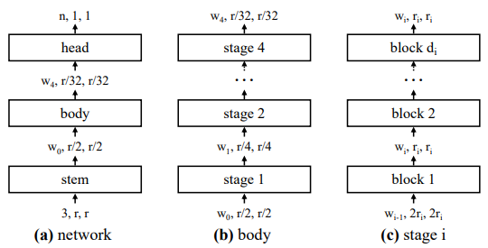
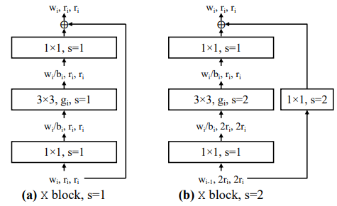
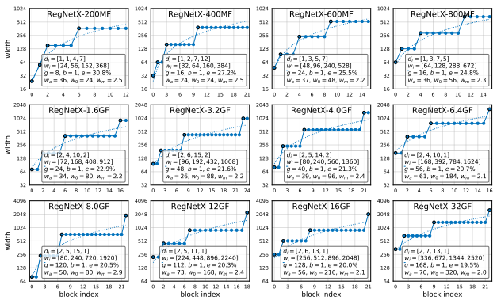
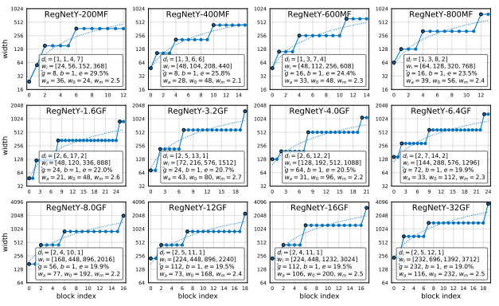

# RegNet

Unofficial PyTorch implementation of RegNet based on paper [Designing Network Design Spaces](https://arxiv.org/abs/2003.13678).

---
## Model Architecture
<figure>

<figcaption align = "center"><b>General network structure</b></figcaption>
</figure>

<figure>

<figcaption align = "center"><b>X block based on the standard residual bottleneck
block with group convolution</b></figcaption>
</figure>

---
## RegNetX and RegNetY models
<figure>

<figcaption align = "center"><b>Top RegNetX Models</b></figcaption>
</figure>

<figure>

<figcaption align = "center"><b>Top RegNetY Models</b></figcaption>
</figure>

---

## Citation :
```
@InProceedings{Radosavovic2020,
  title = {Designing Network Design Spaces},
  author = {Ilija Radosavovic and Raj Prateek Kosaraju and Ross Girshick and Kaiming He and Piotr Doll{\'a}r},
  booktitle = {CVPR},
  year = {2020}
}
```


### If this implement have any problem please let me know, thank you.